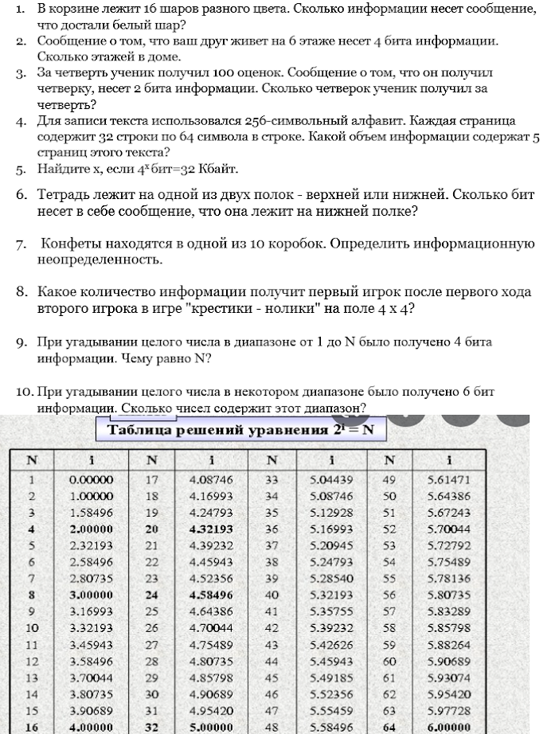

# Image to text converter

## Usage:
```shell
$ pip install requests
$ python main.py
```

You just have to set the path of your image into the script. After that, run this program.

## FAQ
- How it works?

Easy. Look at my work on informatics class (original and recognized image):

Before:


After:

